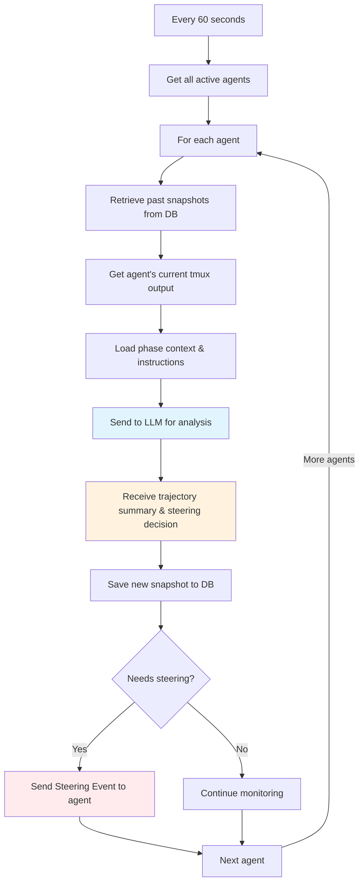

# Work-Centric Supervision: Keeping Agents On Track

Here's the thing about AI agents: they're brilliant at focused work, but they drift. They get stuck in loops. They forget mandatory steps. They work on the wrong things.

That's where **Work-Centric Supervision** comes in.

## What The Supervisor Actually Does

Every 60 seconds, the **Project Supervisor** wakes up and checks every active agent in your workflow. But it's not a simple health check — it's **trajectory analysis**.

The Supervisor asks:
- Is this agent working toward their actual goal?
- Did they miss any mandatory steps from the phase instructions?
- Are they stuck in an error loop?
- Did they drift to unrelated work?
- Are they violating constraints from earlier in the conversation?

Then it makes a decision: continue watching, or intervene with targeted guidance via **Steering Events**.

The best part? The Supervisor remembers everything. Constraints don't disappear just because they were mentioned 20 minutes ago. If you said "no external libraries" at the start of the workflow, the Supervisor will enforce that throughout the entire session — even if the agent forgets.

## How It Works: Building Context

Here's where it gets interesting. The Supervisor doesn't just look at what the agent is doing right now. It builds **accumulated context** from the entire conversation history.

Every 60 seconds, the `ProjectSupervisor`:

1. **Retrieves past summaries** from the database
   - "15 minutes ago: Agent exploring auth patterns"
   - "10 minutes ago: Started JWT implementation"
   - "5 minutes ago: Writing token validation logic"

2. **Captures current state** from the agent's tmux output
   - What files are they working on?
   - What commands did they run?
   - Are there error messages?

3. **Loads phase context** from your phase definitions
   - What are the mandatory steps?
   - What are the done definitions?
   - What constraints were specified?

4. **Sends everything to an LLM** (configurable — we recommend `gpt-oss:120b` via OpenRouter with Cerebras provider for speed and cost)

5. **Saves a new `TrajectorySnapshot`** of what the agent accomplished this cycle

The snapshots create a timeline. The Supervisor can see the agent's entire journey, not just the current moment.

## Trajectory Thinking

This accumulated context is what enables **trajectory thinking**.

When the Supervisor analyzes an agent working on authentication, it knows:

**Overall Goal**: Build JWT authentication system
**Session Duration**: 45 minutes
**Active Constraints**:
- "No external auth libraries" (said 20 minutes ago, **still applies**)
- "Must use built-in crypto module"

**Standing Instructions**:
- "Always write tests for new functions"
- "Include error handling"

**Past Progress** (from snapshots):
- Explored existing auth code
- Started implementing token generation
- Hit an error loading JWT secret from config
- Currently debugging the secret loading issue

The Supervisor tracks everything. Constraints persist until explicitly lifted. Instructions from the start of the session remain active. The agent's history informs whether their current action makes sense.

If the agent tries to install `jsonwebtoken` package, the Supervisor catches it immediately: "You're violating the 'no external auth libraries' constraint from 20 minutes ago. Use Node.js built-in crypto module instead."

## When The Supervisor Intervenes

The Supervisor detects several steering situations and issues **Steering Events**:

**Stuck** — Same error appearing 5+ times
```
You've hit the JWT secret error 6 times now. The issue is line 47 where you
initialize the validator. Check your environment variable loading in config.js.
```

**Drifting** — Working on unrelated areas
```
You're working on the database schema, but your Phase 2 task is to implement
authentication. Please return to implementing the auth system.
```

**Violating Constraints** — Breaking rules from earlier in the conversation
```
You're installing 'bcrypt', but Phase 2 instructions mandate "No external
libraries." Use Node.js crypto.pbkdf2() for password hashing.
```

**Idle** — Agent finished but hasn't updated status
```
You've completed the implementation. Tests are passing. Please call
update_task_status with status='done' and provide a summary.
```

**Missed Steps** — Agent skipped mandatory phase instructions
```
Phase instructions require: search_tickets() before creating new tickets.
You created a ticket without searching. Please search now to avoid duplicates.
```

## The Monitoring Loop



Every agent gets analyzed. Every agent gets full trajectory context. Every agent gets intelligent steering when needed.

## LLM Configuration

The Supervisor's LLM is **configurable**. We recommend:

**`gpt-oss:120b` via OpenRouter with Cerebras provider** — Extremely fast (1000+ tokens/sec), cost-effective, great reasoning

You can also use:
- OpenAI GPT-4
- Anthropic Claude
- Any model that supports structured analysis

The key is speed — The Supervisor runs every 60 seconds for every active agent, so fast inference matters. Cerebras provides exceptional speed through OpenRouter.

## The Result: Self-Healing Workflows

Work-Centric Supervision creates workflows that correct themselves:

**Without Supervision:**
- Agent drifts off-task → wasted work
- Agent forgets mandatory steps → incomplete work
- Agent violates constraints → wrong implementation
- Agent gets stuck → workflow stalls

**With Supervision:**
- Agent drifts → redirected immediately
- Agent forgets steps → reminded of requirements
- Agent violates constraints → intervention with context
- Agent gets stuck → targeted help to overcome blocker

The workflow heals itself based on what agents are actually doing.
